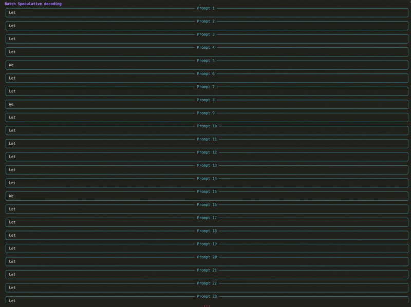

# Speculative Decoding

This repository is a pytorch implementation of Speculative Decoding / Speculative Sampling ([Leviathan et al., 2023](#1); [Chen et al., 2023](#2)).
It contains the code for three generation strategies: classic auto-regressive decoding, speculative decoding with draft and batched speculative decoding. Auto-regressive decoding and Speculative Decoding can be used in a greedy or nucleus sampling (temperature, top k and top p) setting.

## What is Speculative Decoding?

Speculative Decoding is a decoding strategy for transformers that allows to generate sequences faster than the classic auto-regressive decoding without changing the output distribution or requiring further fine-tuning. It uses a smaller, more efficient approximation model (called a "drafter") to generate speculative token prefixes. These prefixes are then evaluated in parallel by the larger target model, reducing the number of serial decoding steps required and leading to inference speedups.

The core process rely on the specific behavior of the Transformer model that allows to compute the probability distribution of all the fed in tokens. This distribution is then used to verify the drafts generated by the drafter model.

<p align="center">
    
    <br>
    <em>Figure 2: Overview of Speculative Decoding.</em>
</p>

## Batched Speculative Decoding

<p align="center">
    
    <br>
    <em>Figure 3: Batched Speculative Decoding</em>
</p>


## How to use

### 0. Installation
This project requires Python 3.12 or later and the following dependencies:

```
rich
tqdm
termcolor
tokenizers
torch
transformers
accelerate
bitsandbytes
```

Simply fork this repository and install the dependencies.

### 1. Generate text using Speculative Decoding

#### a. Load the target and drafter model

The target model is the transformer model we want to accelerate, while the drafter model is the smaller model that will be used to generate drafts to the target model.

Here are some requirements to make speculative decoding work:
- The target model must be a transformer model.
- The drafter model must share the same tokenizer as the target model.
- The target model and the drafter model should output same shape logits.
- The target model should be large enough to benefit from the acceleration. (causing a bottleneck in memory)
- The drafter model should be small enough to be faster than the target model.

```python
from transformers import AutoTokenizer, AutoModelForCausalLM

target_model_name = "Qwen/Qwen3-4B-Instruct-2507"
target_model = AutoModelForCausalLM.from_pretrained(target_model_name)

drafter_model_name = "Qwen/Qwen3-0.6B"
draft_model = AutoModelForCausalLM.from_pretrained(drafter_model_name)

# Don't forget to load the tokenizer
tokenizer = AutoTokenizer.from_pretrained(target_model_name)
```

#### b. Prepare batched input

Input is expected in a batch of prompts. The input should be tokenized and encoded using the tokenizer. Since attention mask is not passed, do not pad the prompts.

```python
input_ids = tokenizer(batch_prompts, max_length=1024, truncation=True).input_ids
```

#### c. Generate text

Speculative Decoding uses one hyperparameter: $\gamma$, the number of drafts generated by the drafter model at each step. 

```python
for start_idx in range(0, len(prompts), batch_size):
    end_idx = min(start_idx + batch, len(prompts))
    batch_prompts = prompts[start_idx:end_idx]['prompt']
    print(f"Evaluating prompts {start_idx} to {end_idx-1}...")
    input_ids = tokenizer(batch_prompts, max_length=1024, truncation=True).input_ids
    output_ids_sd, alpha, stats = speculative_generate_batch(
        input_ids,
        draft_model,
        target_model,
        logits_processor=logits_processor, # for sampling
        gamma=gamma, # draft length
        max_gen_len=max_new_tokens,
        eos_tokens_id=tokenizer.eos_token_id,
        pad_token_id=tokenizer.pad_token_id,
        tokenizer=tokenizer,
    )
```

## References
<a id="1">[1]</a> Leviathan, Y., Kalman, M. &amp; Matias, Y.. (2023). Fast Inference from Transformers via Speculative Decoding. <i>Proceedings of the 40th International Conference on Machine Learning</i>, in <i>Proceedings of Machine Learning Research</i> 202:19274-19286 Available from https://proceedings.mlr.press/v202/leviathan23a.html.

<a id="2">[2]</a> Chen, C., Borgeaud, S., Irving, G., Lespiau, J. B., Sifre, L., & Jumper, J. (2023). Accelerating large language model decoding with speculative sampling. arXiv preprint arXiv:2302.01318. 

<a id="3">[3]</a> Jie Ou, Yueming Chen, Wenhong Tian. (2024). Lossless Acceleration of Large Language Model via Adaptive N-gram Parallel Decoding. <i>Proceedings of the 2024 Conference of the North American Chapter of the Association for Computational Linguistics: Human Language Technologies (Volume 6: Industry Track), pages 10–22</i>
